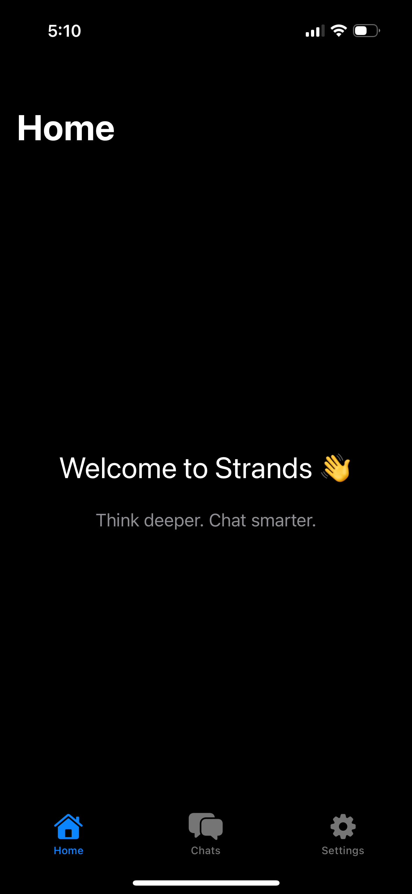
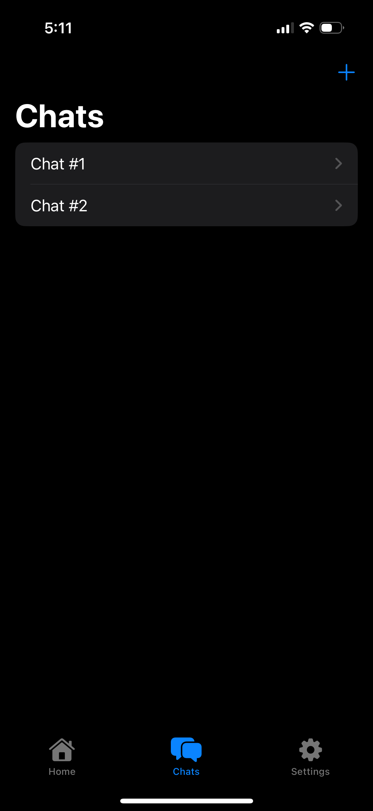
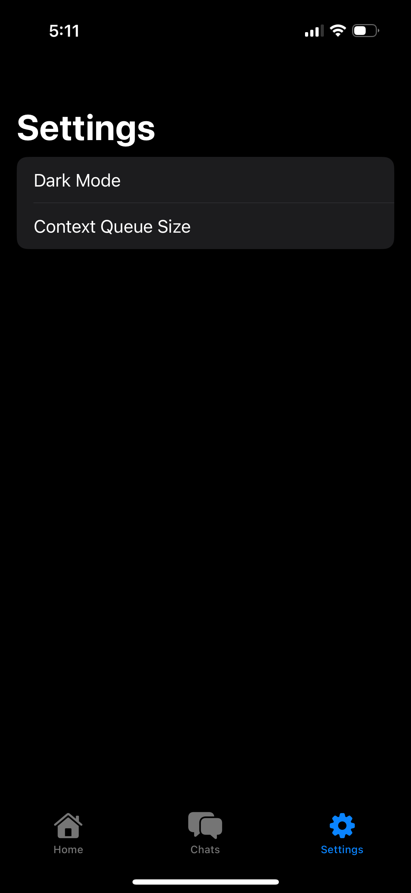
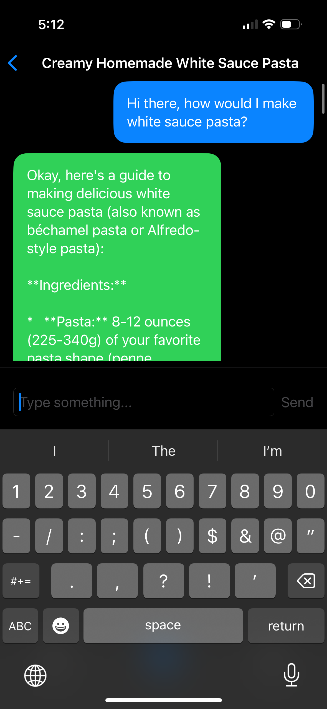
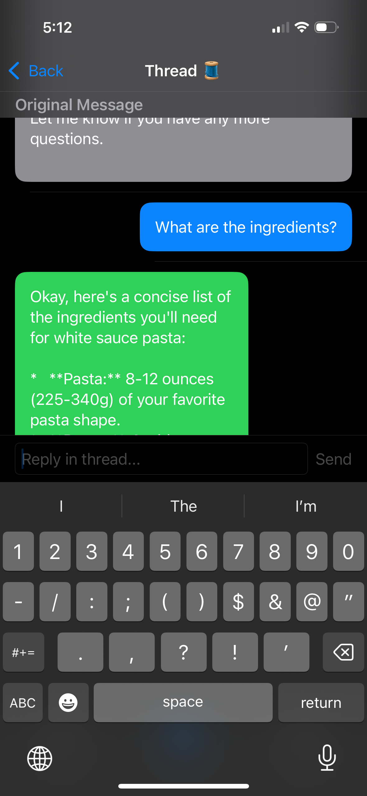

# 🧵 Strands – iOS App

Strands is a thread-based AI conversation app that helps users **think deeper and chat smarter** by keeping ideas contextual, threaded, and easy to navigate.

This iOS app is a SwiftUI-based adaptation of the existing web version of Strands.

## 🚀 Features (in-progress)

| Feature                        | Status       | Notes                                                                 |
|-------------------------------|--------------|-----------------------------------------------------------------------|
| 🏠 Home Screen                 | ✅ Complete   | Clean welcome message with branding and purpose.                      |
| 💬 Main Chat Interface         | ✅ Complete   | Supports sending messages, getting Gemini responses, and auto-title. |
| 🧵 Threaded Conversations      | ✅ Complete   | Can open threads from a message and continue the conversation.       |
| 📱 Tab Navigation              | ✅ Complete   | Home, Chats, Settings (with icons and bottom bar).                   |
| 🧠 Gemini API Integration      | ✅ Complete   | Fully working with context-based replies.                            |
| 🧪 Chat Title Auto-generation  | ✅ Complete   | Generated after first message/response pair.                         |
| 📂 Save Chat (not included)    | ❌ Not Yet    | Save functionality intentionally excluded in iOS version for now.    |
| ☁️ Cross-platform Sync         | ❌ Not Yet    | Currently local only, Supabase integration TBD.                      |
| 🔐 Auth / Onboarding           | ❌ Not Yet    | To be added later.                                                   |

  
| Home Screen | Chats Tab | Settings |
|------------|-------------|--------------|
|  |  |  |

| Chat Screen | Thread Button | Thread Screen |
|-------------|----------------|---------|
|  |  |  |

